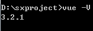
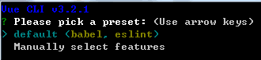
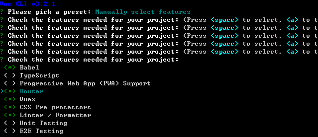
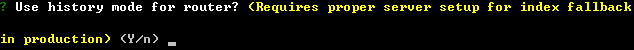
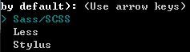
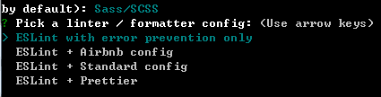
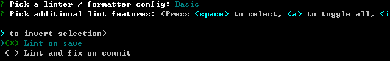
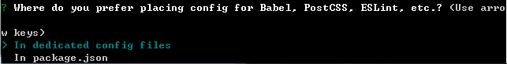
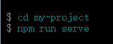

# Day01
## Vue-cli3.0的安装
```
npm install -g @vue/cli
yarn global aadd @vue/cli
```

## 检测安装
`vue -V`



## vue项目的创建
`vue create 项目名称`



选择第二行



选择如上，空格进行单行选择，enter进行确认进入下一步



选择Y，enter进入下一步



选择第一项Sass/SCSS



选择第一个



选择第一个



选择第一个


选择no，enter后开始安装



`npm run serve`进行项目的启动

## 组件的使用
### 组件的注册
* 在当前项目下安装echarts以及element组件库
```
npm install echarts --save
npm install element-ui -S
```
* 在建好的vue项目的main.js文件中引入element组件库`import ElementUI from 'element-ui'`以及组件库的渲染`import 'element-ui/lib/theme-chalk/index.css';`和组件库的使用`Vue.use(ElementUI);`
### var和let的区别
* let：变量只能声明一次
* var：变量可以多次声明
* let的好处是当我们写代码比较多的时候可以避免在不知道的情况下重复声明变量，同时更适合使用for循环。
### 类型检查
type可以使下列原生构造函数中的一个:
* String
* Number
* Boolean
* Array
* Object
* Date
* Function
* Symbol
