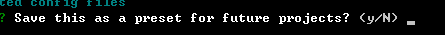

# Day01
## Vue-cli3.0的安装
```
npm install -g @vue/cli
yarn global add @vue/cli
```

## 检测安装
`vue -V`


## vue项目的创建
`vue create 项目名称`


选择第二行


选择如上，空格进行单行选择，enter进行确认进入下一步


选择Y，enter进入下一步


选择第一项Sass/SCSS


选择第一个


选择第一个


选择第一个



选择no，enter后开始安装


`npm run serve`进行项目的启动

## 组件的使用
### 组件的注册
* 在当前项目下安装echarts以及element组件库
```
npm install echarts --save
npm install element-ui -S
```
* 在建好的vue项目的main.js文件中引入element组件库`import ElementUI from 'element-ui'`以及组件库的渲染`import 'element-ui/lib/theme-chalk/index.css';`和组件库的使用`Vue.use(ElementUI);`
### var和let的区别
* let：变量只能声明一次
* var：变量可以多次声明
* let的好处是当我们写代码比较多的时候可以避免在不知道的情况下重复声明变量，同时更适合使用for循环。
### 类型检查
type可以使下列原生构造函数中的一个:
* String
* Number
* Boolean
* Array
* Object
* Date
* Function
* Symbol
## vue有关的绑定
### 一、v-bind绑定class(v-bind可简写为：)
* 对象的形式
`<div :class="{text-danger:true}"></div>`
* 数组形式绑定class
`<div :class="[textRed,base,radius]"></div>`
### 二、绑定style样式
#### 1.对象的形式绑定样式
##### html结构
`<div :style="styleObj">some text here...</div>`
##### vue 对象
```
new Vue({
    el: ".box",
    data: {
        styleObj: {
             width: "200px",
             height: "200px",
             backgroundColor: "green",
             color: "yellow"
         }
    }
})
```
### 三、v-model双数据绑定（一般用于为input输入框绑定输入值）
`<input v-model="myvalue" type="text"/>`
#### input类型分为text/checkbox/radio...
#### select
### 四、 vue中的时间绑定
#### 1、事件绑定的第一种方式
##### html结构
`<button v-on:click="myclick"></button>`
##### vue对象
```
new Vue({
     el:".box",
     methods:{
         myclick:function(){

         }
      }
 })
```
#### 2、绑定事件的第二种方式（简写形式）
##### html结构
`<button @click="myclick"></button>` //官方推荐事件绑定用简写形式
##### vue对象
```
new Vue({
     el:".box",
     methods:{
         myclick:function(){

         }
      }
 })
```
可以绑定事件类型： @click/mouseover/mouseout/keydown/keyup......
#### 3、监听键盘事件
##### 所有的键盘事件keydown/keyup/keypress
##### vue内置事件对象
```
<input @keydown="input($event)" />
  new Vue({
      el:".box",
      methods:{
          input:function(ev){
          }
      }
  })
```
##### 自带的键盘事件名
* keyup.left/right/up/down
* keydown.left/right/up/down
* keypress.left/right/up/down
##### 自定义键盘按下事件修饰符
```
Vue.config.keyCodes = {
        zero:48
      }
<input type="text" @keydown.zero="input" />
```
#### 4、vue自带的事件修饰符
* prevent/stop/self/once
* prevent 阻止事件的默认行为
* stop 阻止事件冒泡
### 五、v-if
v-if的作用是控制DOM是否显示
### 六、v-show
v-show也是控制dom显示与否的，v-show 没有v-if的多个判断功能，而且v-show是把dom渲染到文档中，只是加了display:none而已。
### 七、v-for
循环，又叫列表渲染，在需要显示多个的标签上加这个。
### 八、v-on（简写为@）
表示事件监听
