# 使用 vue-lic3 创建 vue 项目
- 在使用 vue-lic3 创建 vue 项目工程之前首先要确保已经安装了 nodejs，webpack.
- vue-cli 是 vue 的脚手架，可以用配置好的模版快速搭建起一个项目工程，不用自己去配置 webpack 配置文件的基本内容。
- 安装 vue-cli 3.0 版本：通过 ```npm install -g @vue/cli``` 或 ```yarn global add @vue/cli``` 安装 vue-cli 3.
>注意：如果已经安装了旧版本，可以使用 ```npm uninstall vue-cli -g``` 或 ```yarn global remove vue-cli``` 卸载旧版本，然后再安装新版本。
- 安装完后使用 ```vue -V``` 检查版本，出现如下界面表示安装成功。  
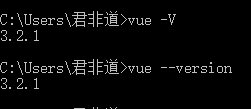  
- 现在开始创建我们的 vue 项目工程，进入到你要创建项目的文件或磁盘，比如我想在 G 盘创建项目，那就在 G 盘输入命令 ```vue create my-project```  
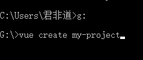  
它会自动在 G 盘创建一个 my-project 的工程文件夹，按 enter 进入下一步出现如下界面。    
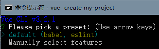  
这里有两个选项，第一个是默认的，第二个提供更多的选择，可以选择自己需要的功能，我这里选择第二个，按 enter 会看到如下界面。  
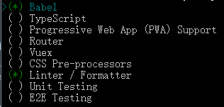  
这里有九个选项，按方向键切换当前选项，按空格键选中当前选项，我说一下这九个选项的意思：
- ```Babel：``` 提供 babel 支持。
- ```TypeScript：``` 支持 TypeScript 格式。
- ```Progressive Web App (PWA) Support：``` [PWA](https://developers.google.com/web/progressive-web-apps/) 支持（渐进式Web应用程序）。
- ```Router： ``` 支持 [Vue Router](https://router.vuejs.org/zh/) ，它是Vue.js 官方的路由管理器。
- ```Vuex：``` 支持 [Vuex](https://vuex.vuejs.org/zh/) ，它是一个专为 Vue.js 应用程序开发的状态管理模式。
- ```CSS Pre-processors：``` 支持 CSS 预处理器，可以选择自己想要的处理器。
- ```Linter / Formatter：```
>```Linter``` 检查代码错误的小工具。
>```Formatter``` 用来格式化文本，主要用在文本输出方面，比如，数字、日期、金额等。
- ```Unit Testing``` 支持单元测试。
- ```E2E Testing``` 支持 e2e 测试。
>e2e 测试是一种测试方法，它用来测试一个应用从头到尾的流程是否和设计时候所想的一样。简而言之，它从一个用户的角度出发，认为整个系统都是一个黑箱，只有UI会暴露给用户。

本次选择如下：    
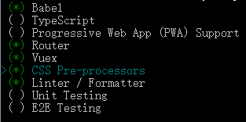  
按 enter 进入下一步。  
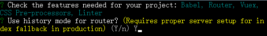  
路由是否使用历史模式，我选择 Y ，按 enter 进入下一步。  
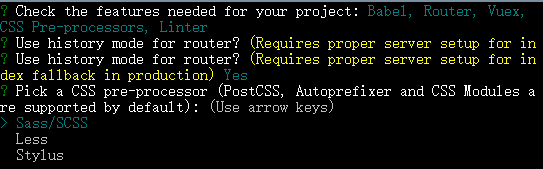  
选择CSS预处理器，我选 Sass/SCSS ,按 enter 进入下一步。  
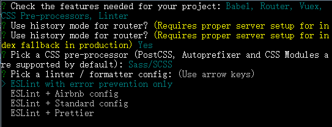  
选择 linter / formatter 配置，使用方向键选择，我选第一个，按 enter 进入下一步。  
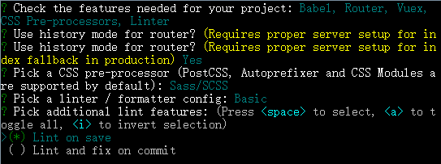  
第一个需要设置保存的路径，我选择第二个，按 enter 进入下一步。  
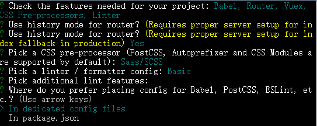  
这一步选择配置文件的位置，出于对 vscode 的友好支持，我选择第一个，按 enter 进入下一步。  
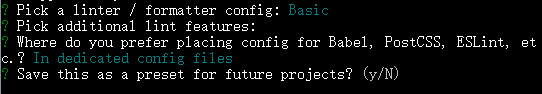  
要不要把当前的这一系列选项配置保存起来，方便下一次创建项目时复用,我选 no，按 enter 进入下一步,这时就开始自动配置了。  
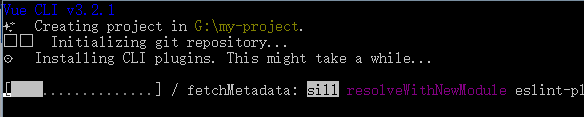  
- 至此 vue 项目工程创建完毕，系统提示你进入项目文件夹，然后启动项目：  
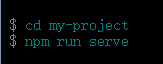  
输入 ```cd my-project``` 按回车，再输入 ```npm run serve``` 按回车，会出现如下界面表示项目已经启动：  
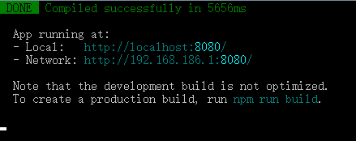  
现在可以在浏览器输入 ```http://localhost:8080``` 会看到这个界面 。 
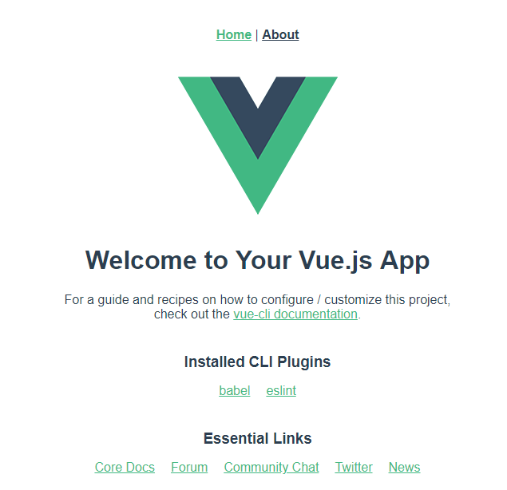


