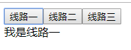

# vue 动态组件

- 动态组件就是几个组件放在一个挂载点下，然后根据父组件的某个变量来决定显示哪个，或者都不显示。
- 在挂载点使用 component 标签，然后使用 is =“组件名”，它会自动去找匹配的组件名，如果有，则显示；

看例子：

```html
<!-- html部分 -->

<div id="app">
    <component is="one"></component>
</div>
```

```javascript
// js 部分

new Vue({
    el: '#app',
    components: {
        one: {template: '<div>我是线路一</div>'},
        two: {template: '<div>我是线路二</div>'},
        thr: {template: '<div>我是线路三</div>'}
    }
})
```

上面代码注册了三个组件，在 component 标签里有个属性 is，is=one，所以页面会渲染名字叫 one 的组件，显示结果如下：

>我是线路一

如果给 is 属性绑定动态值，那么就可以实现组件的动态切换，例子如下：

```html
<!-- html 部分 -->

<div id="app" class="demo">
    <button v-for="(tab,key) in tabs" @click="tabIndex=key">
        {{ tab }}
    </button>
    <component v-bind:is="change"></component>
</div>
```

```javascript
// js 部分

new Vue({
  el: '#app',
  data: {
    tabIndex: 'home',
    tabs: ['线路一','线路二','线路三'],
    statu: ['lineOne','lineTwo','lineThr']
  },
  components: {
    lineOne: {template: '<div>我是线路一</div>'},
    lineTwo: {template: '<div>我是线路二</div>'},
    lineThr: {template: '<div>我是线路三</div>'}
  },
  computed: {
    change() {
      return this.statu[this.tabIndex]
    }
  }
})
```

上面代码用 v-bind 给属性 is 动态传递了值，实现了组件的动态切换，效果如下：

