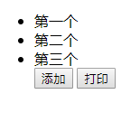
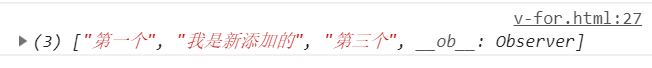
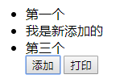
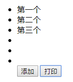

### 条件渲染

- 如果想用 v-if 切换多个元素可以将这些元素包裹起来。

```html
<!-- html 部分 -->

<body>
    <div id="app">
        <template v-if="ok">
            <h1 v-else>Title</h1>
            <p>Paragraph 1</p>
            <p>Paragraph 2</p>
        </template>
    </div>
</body>
```

```javascript
// js 部分

new Vue({
    el: '#app',
    data: {
        ok: true
    }
})
```

上面代码在 template 标签里面包裹了三个标签（用 div 标签包裹也可以），用 v-else 控制显示哪个

渲染结果如下：

>Paragraph 1
>Paragraph 2

### 列表渲染

- 如同 v-if 一样，v-for 也可以同时渲染多个元素。

```html
<!-- html 部分 -->

<div id="app">
  <ul>
    <template v-for="site in sites">
      <li>{{ site.name }}</li>
      <li>--------------</li>
    </template>
  </ul>
</div>
```

```javascript
// js 部分

new Vue({
  el: '#app',
  data: {
    sites: [
      { name: '元始天尊' },
      { name: '太乙真人' },
      { name: '太上老君' }
    ]
  }
})
```

上面代码证中 template 标签包裹了两个元素，则这两个元素会被同时渲染。
渲染结果：

>元始天尊
>\--------------
>太乙真人
>\--------------
>太上老君
>\--------------

```
如果将 v-for="site in sites" 中的数组 sites 换成数字，则数字就是渲染的次数.
```

### 数组变动

由于 JavaScript 的限制， Vue 不能检测以下变动的数组：

> 1. 当你直接设置一个项的索引时，例如： ```vm.items[indexOfItem] = newValue```

> 2. 当你修改数组的长度时，例如： ```vm.items.length = newLength```

为了避免第一种情况，以下两种方式将达到像 vm.items[indexOfItem] = newValue 的效果， 同时也将触发状态更新：

```Vue.set(example1.items, indexOfItem, newValue)```

```this.items.splice(indexOfItem, 1, newValue)```

看例子：

```html
<!-- html 部分 -->

<div id="app">
    <ul>
        <li v-for="item in statu">{{item}}</li>
        <button @click="addItem">添加</button>
        <button @click="viewItem">打印</button>
    </ul>
</div>
```

```javascript
// js 部分

new Vue({
    el: '#app',
    data: {
        statu: ['第一个', '第二个', '第三个']
    },
    methods: {
        viewItem() {
            console.log(this.statu)
        },
        addItem() {
            this.statu[1] = "我是新添加的"
        }
    },
})
```

上面代码使用了我们常规的方法，直接设置一个项的 结果如下：





点击添加按钮，页面上的元素不会发生变化，但是点击打印发现数组确实被改变了，之所以页面没有渲染是因为直接设置下标这种方式不会被 ```vue``` 检测到。

现在用第一种方式去改变数组。

```javascript
addItem() {
    this.$set(this.statu, 1, "我是新添加的")
}
```

使用这种方式点击添加按钮之后页面如下：



现在使用第二种方式去改变数组。

```javascript
addItem() {
    this.statu.splice(1, 1, "我是新添加的")
}
```

使用这种方式点击添加按钮之后页面如下：


可以看到上面这两种方式都会被 vue 检测到。

避免第二种情况，使用 splice ：

```this.items.splice(this.items.length = newLength)```

```javascript
addItem() {
    this.statu.splice(this.statu.length = 6)
}
```

通过这种方式改变数组长度，vue 可以检测到，而如果直接写 this.statu.length = 6， vue 是不会检测到的，页面也不会更新。


