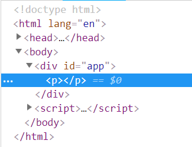
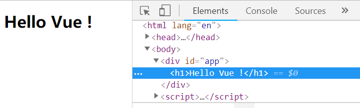
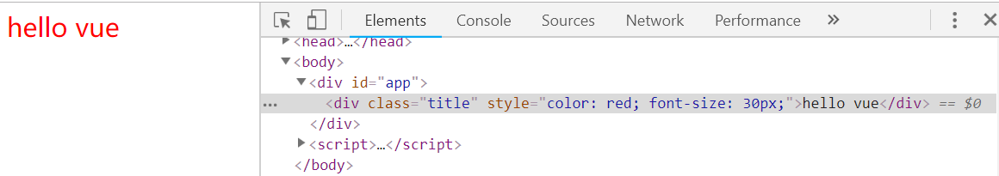
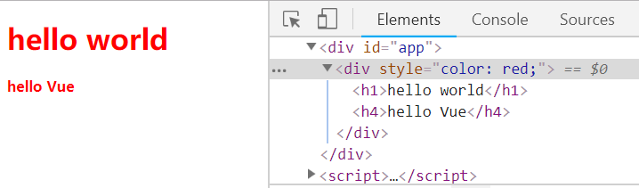
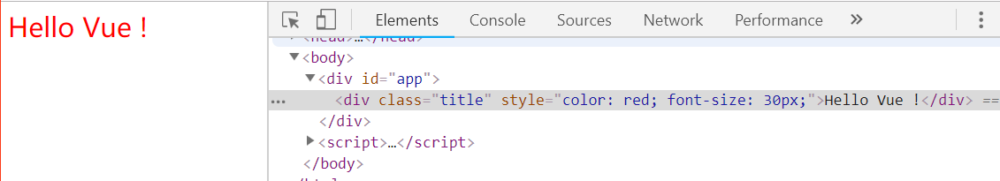
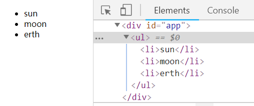
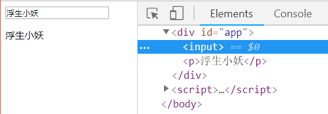

# render 函数

#### createElement 函数可接收多个参数

- 第一个参数 {String | Object | Function}，可以是三者中的一个。

```javascript
// 第一个参数为 String

<div id="app">
  <custom-element></custom-element>
</div>

Vue.component('custom-element', {
  render: function(createElement) {
    return createElement('p')
  }
})

let app = new Vue({
    el: '#app'
})
```



上面代码中 createElement 的第一个参数为一个字符串 ‘p’，渲染之后可以在浏览器控制台可以看到 p 标签

```javascript
// 第一个参数为 Object

<div id="app">
  <custom-element></custom-element>
</div>

Vue.component('custom-element', {
  render: function(createElement) {
    return createElement({
      template: '<h1>Hello Vue !</h1>'
    })
  }
})

let app = new Vue({
    el: '#app'
})
```

上面代码中 createElement 的第一个参数为```{template: '<h1>Hello Vue !</h1>'}``` 对象，此时渲染结果如下：



```javascript
// 第一个参数为 Function

<div id="app">
  <custom-element></custom-element>
</div>

Vue.component('custom-element', {
  render: function(createElement) {
    var eleFun = function() {
      return {
        template: '<h1>Hello Vue !</h1>'
      }
    }
    return createElement(eleFun())
  }
})

let app = new Vue({
    el: '#app'
})
```

上面代码中 createElement 的第一个参数为一个方法，方法返回一个对象，渲染结果如下：


- 第二个参数: Object

```javascript
<div id="app">
  <custom-element></custom-element>
</div>

Vue.component('custom-element', {
  render: function(createElement) {
    return createElement(
      'div',
      {
        'class': {
          title: true
        },
        'style': {
          color: 'red',
          fontSize: '30px'
        },
        'atrrs': {
          id: 'boo'
        },
        'domProps': {
          innerHTML: 'hello vue'
        }
      } 
    )
  }
})

let app = new Vue({
    el: '#app'
})
```

渲染结果如下：



- 第三个参数：{String | Array}

```javascript
// 第三个参数为 Array

<div id="app">
  <custom-element></custom-element>
</div>

Vue.component('custom-element', {
  render: function(createElement) {
    return createElement(
      'div',
      {
        'class': {
          title: true
        },
        'style': {
          color: 'red'
        },
      },
      [
        createElement('h1', 'hello world'),
        createElement('h4', 'hello Vue')
      ]
    )
  }
})

let app = new Vue({
    el: '#app'
})
```

渲染结果如下：



```javascript
// 第三个参数为 String

<div id="app">
  <custom-element></custom-element>
</div>

Vue.component('custom-element', {
  render: function(createElement) {
    return createElement(
      'div',
      {
        'class': {
          title: true
        },
        'style': {
          color: 'red',
          fontSize: '30px'
        },
      },
      'Hello Vue !'
    )
  }
})

let app = new Vue({
    el: '#app'
})
```

渲染结果如下：



#### 在 render 函数里模仿 v-if、v-for 、v-model

```javascript
// 模仿 v-if 和 v-for

<div id="app">
  <item-list :items="items"></item-list>
</div>

Vue.component('item-list', {
  props: ['items'],
  render: function(createElement) {
    if(this.items.length) {
      return createElement('ul', this.items.map((item) => {
        return createElement('li',item)
      }))
    } else {
      return createElement('p', 'No items found')
    }   
  }
})

let app = new Vue({
  el: '#app',
  data() {
    return {
      items: ['sun', 'moon', 'erth']
    }
  }
})
```

渲染结果如下：



```javascript
// 模仿 v-model 

<div id="app">
  <el-input :name="name" @input="val => name=val"></el-input>
  <p>{{name}}</p>
</div>

Vue.component('el-input', {
  render: function(createElement) {
    var self = this
    return createElement('input', {
      domProps: {
        value: self.name
      },
      on: {
        input: function(event) {
          self.$emit('input', event.target.value)
        }
      }
    })
  },
  props: {
    name: String
  }
})

let app = new Vue({
  el: '#app',
  data: {
    name: '浮生小妖'
  }
})
```

渲染结果如下：


