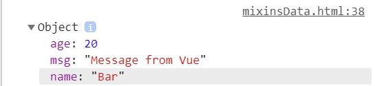
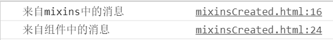
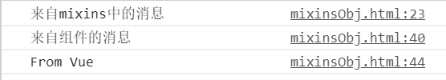

# mixins 学习笔记

---

#### mixins是一种分发Vue组件中可复用功能的一种灵活方式。

mixins是一个JavaScript对象，可以包含组件中的任意选项，比如Vue实例中生命周期的各个钩子函数，也可以是data、components、methods或directives等。在Vue中，mixins为我们提供了在Vue组件中共用功能的方法。将共用的功能以对象的方式传入mixins选项中。当组件使用mixins对象时，所有mixins对象的选项都将被混入该组件本身的选项。

- 将 mixin 混入到组件

```javascript
<div id="app"></div>

const myMixin = {
  created() {
    console.log('来自 myMixin')
  }
}
let app = new Vue({
  el: '#app',
  mixins: [myMixin]
})
```

打印结果：


上面代码，mixin对象中的钩子函数混入到了组件中。

#### 在Vue中mixins常见的合并主要有三种情形：数据data、生命周期中的钩子函数和值为对象的选项。

- 合并数据 data

```javascript
const mixObj = {
  data() {
    return {
      msg: 'Message from object'
    }
  }
}
const minObjAnother = {
  data() {
    return {
      msg: 'Message from another object',
      name: 'Foo'
    }
  }
}

let app = new Vue({
  el: '#app',
  data: {
    msg: 'Message from Vue',
    name: 'Bar',
    age: 20
  },
  mixins: [mixObj,minObjAnother],
  created() {
    console.log(this.$data)
  }
})
```

打印结果： 



在和组件的数据发生冲突时，以组件数据优先。

- 钩子函数合并

```javascript
const myMixin = {
  created() {
    console.log('来自mixins中的消息')
  }
}

let app = new Vue({
  el: '#app',
  mixins: [myMixin],
  created() {
    console.log('来自组件中的消息')
  }
})
```

打印结果如下：



当组件使用的mixins对象有相同的选项时，比如钩子函数，就会全部被合并到一个数组中，因此都会被执行，并且mixins`对象中的钩子会先被执行。

- 合并对象

```javascript
const myMixin = {
  data() {
    return {
      msg: 'From myMixin'
    }
  },
  created() {
    console.log('来自mixins中的消息')
  },
  methods: {
    message() {
      console.log(this.msg)
    }
  }
}
let app = new Vue({
  el: '#app',
  data() {
    return {
      msg: 'From Vue'
    }
  },
  mixins: [myMixin],
  created() {
    console.log('来自组件的消息')
  },
  methods: {
    message() {
      console.log(this.msg)
    }
  }
})
```

打印结果：



当mixins对象和组件中的选项的值为对象时，比如methods、components和directives，将被混合为同一个对象。当两个对象键名冲突时，组件选项优先。

>如果有两个 mixins 对象，他们有同名的钩子函数，则后者引入的会执行，前者引入的不会执行