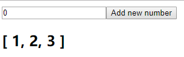

# vue 中的状态管理

----

#### 在Vue中大致有三种方式可以管理兄弟组件之间的数据通讯，从而处理应用程序的状态管理：

1. 使用全局的EventBus（事件总线）

2. 使用简单的全局存储

3. 使用Vuex

---

- 使用全局的EventBus（事件总线）

```javascript
// event-bus.js

import Vue from 'vue'
export const EventBus = new Vue()
```

```javascript
// NumberSubmit.vue

<template>
    <div id="app">
        <input type="number" v-model="number">
        <button @click="addNumber">Add new number</button>
    </div>
</template>

<script>
import { EventBus } from '../event-bus.js'
export default {
    name: 'NumberSubmit',
    data() {
        return {
            number: 0
        }
    },
    methods: {
        addNumber() {
            EventBus.$emit('number-added', Number(this.number))
        }
    }
}
</script>
```

```javascript
// NumberDisplay.vue

<template>
    <div>
        <h2>{{ numbers }}</h2>
    </div>
</template>

<script>
import { EventBus } from '../event-bus.js'
export default {
    name: 'NumberDisplay',
    data() {
        return {
            numbers: [1, 2, 3]
        }
    },
    created() {
        EventBus.$on('number-added', (number) => {
            this.numbers.push(number)
        })
    }
}
</script>
```

```javascript
// App.vue

<template>
  <div id="app">
    <NumberSubmit></NumberSubmit>
    <NumberDisplay></NumberDisplay>
  </div>
</template>

<script>
import NumberDisplay from './components/NumberDisplay'
import NumberSubmit from './components/NumberSubmit'
export default {
  components: {
    NumberSubmit,
    NumberDisplay
  }
}
</script>
```

上面代码先创建一个EventBus的实例 ，然后NumberSubmit.vue 在 EventBus 中注册了点击事件，并传出了输入框的值。NumberDisplay.vue 通过 $on 事件接受到值并使用。

渲染结果如下：



- 全局存储

```javascript
// store.js

export const store = {
  state: {
    numbers: [1,2,3]
  },
  addNumber(newNumber) {
    this.state.numbers.push(newNumber)
  }
}
```

```javascript
// NumberDisplay.vue

<template>
  <div>
    <h2>{{ storeState.numbers }}</h2>
  </div>
</template>

<script>
import { store } from '../store.js'
export default {
  name: 'NumberDisplay',
  data() {
    return {
      storeState: store.state
    }
  }
}
</script>
```

```javascript
// NumberSubmit.vue

<template>
  <div id="app">
    <input v-model="numberInput" type="number">
    <button @click="addNumber(numberInput)">Add new number</button>
  </div>
</template>

<script>
import { store } from '../store.js'
export default {
  name: 'NumberSubmit',
  data() {
    return {
      numberInput: 0
    }
  },
  methods: {
    addNumber(numberInput) {
      store.addNumber(Number(numberInput))
    }
  }
}
</script>
```

```javascript
// App.vue

<template>
  <div id="app">
    <NumberSubmit></NumberSubmit>
    <NumberDisplay></NumberDisplay>
  </div>
</template>

<script>
import NumberDisplay from './components/NumberDisplay'
import NumberSubmit from './components/NumberSubmit'
export default {
  components: {
    NumberSubmit,
    NumberDisplay
  }
}
</script>
```

最终结果：


>NumberSubmit组件中有一个addNumber()方法，它调用store.addNumber()变量并传递预期的有效负载。

>store方法接收有效负载并直接改变store.numbers数组。由于Vue的响应性（Vue reactivity），当存储状态中的number数组发生更改时，依赖于此值的相关DOM（NumberDisplay组件中的\<template>）会自动更新。

>当我们说组件相互交互时。这些组件不会对彼此做任何事情，而是通过存储相互调用更改。

- Vuex

Vuex存储包含四个对象：state、mutations、actions和getters。

> 1. state: 存储数据
> 2. mutations: 存储操作数据的方法
> 3. actions: 使用方法
> 4. getters: 获取数据

上面的例子用 Vuex 实现

```javascript
// store.js

import Vue from 'vue'
import Vuex from 'vuex'

Vue.use(Vuex)

const state = {
  numbers: [1, 2, 3]
}

const mutations = {
  ADD_NUMBER(state, payload) {
    state.numbers.push(payload)
  }
}

const actions = {
  addNumber(context, number) {
    context.commit('ADD_NUMBER', number)
  }
}

const getters = {
  getNumbers(state) {
    return state.numbers
  }
}

export default new Vuex.Store({
  state,
  mutations,
  actions,
  getters
})
```

```javascript
// NumberDisplay.vue

<template>
  <div>
    <h2>{{ getNumbers }}</h2>
  </div>
</template>

<script>
export default {
  name: 'NumberDisplay',
  computed: {
    getNumbers() {
      return this.$store.getters.getNumbers
    }
  }
}
</script>
```

```javascript
// NumberSubmit.vue

<template>
  <div class="form">
    <input v-model="numberInput" type="text">
    <button @click="addNumber(numberInput)">Add new number</button>
  </div>
</template>

<script>
export default {
  name: 'NumberSubmit',
  data() {
    return {
      numberInput: 0
    }
  },
  methods: {
    addNumber(numberInput) {
      this.$store.dispatch('addNumber', numberInput)
    }
  }
}
</script>
```

```javascript
// App.vue

<template>
  <div id="app">
    <NumberSubmit></NumberSubmit>
    <NumberDisplay></NumberDisplay>
  </div>
</template>

<script>
import NumberDisplay from './components/NumberDisplay'
import NumberSubmit from './components/NumberSubmit'
export default {
  name: 'App',
  components: {
    NumberSubmit,
    NumberDisplay
  }
}
</script>
```

最终结果：

