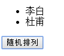
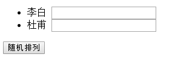

# 为什么用 v-for 渲染的时候要显示指定 key 值

---

### 如果我们的列表中有任何动态的UI更改（比如列表项的顺序被打乱），Vue将选择在每个元素中更改数据，而不是相应的移动DOM元素。这在大多数情况下都不是问题。然而，在某些情况下，v-for渲染出来的列表项依赖于DOM状态和（或）子组件状态，这可能会导致一些非预期的渲染效果。

一般情况：

```javascript
<div id="app">
    <ul>
        <li v-for="item in stat" :key="item.name">
            {{ item.name }}
        </li>
    </ul>
    <button class="is-primary button" @click="shuffle">随机排列</button>
</div>

new Vue({
    el: '#app',
    data: {
        stat: [{'name':'李白'}, {'name':'杜甫'}],
    },
    methods: {
        shuffle() {
            temp = this.stat[0].name
            this.stat[0].name = this.stat[1].name
            this.stat[1].name = temp
        }
    }
})
```

渲染结果：



上面代码渲染了数组，点击按钮可以改变两个数组的排列方式。

现在给每个 li 后面加一个输入框

```html
<div id="app">
  <ul>
    <li v-for="item in stat">
      {{ item.name }}
      <input type="text">
    </li>
  </ul>
  <button class="is-primary button" @click="shuffle">随机排列</button>
</div>
```

渲染结果如下：



在输入框输入前面对应的名字，点击按钮发现只有前面的排列顺序变了，输入框的没变。这是因为Vue在每个元素中更改数据，而不是相应的移动DOM元素，这时就要显示指定 key 值，给每个元素绑定一个唯一的值，这样就不是更改数据，而是移动列表项。

```html
<li v-for="item in stat" :key="item.name">
```