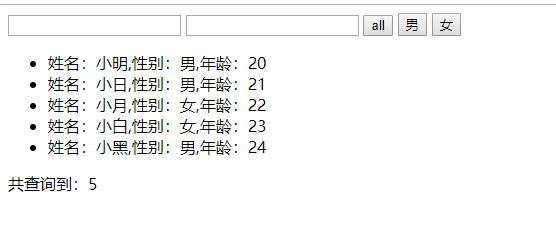

# 使用 vue 做一个查询

## 首先需要创建一个 div 标签；id 为 app。并在 script 标签中实例化一个 vue 并挂在到 app 上。

```html
<div id="app"></div>
```

```javascript
var vm = new Vue({
  el: "#app",
  data() {
    return {};
  }
});
```

## 然后在 div 标签中加入我们需要的标签，通过需求我们知道我们要做一个可以通过姓名年龄性别来查询到数据的搜索功能，所以我们在 div 标签中加入两个 input 框用来搜索姓名和年龄，三个 button 按钮用来选择性别,然会在 ul 中将数据循环出来，

```html
<div id="app">
  <input type="text" v-model="text" /> <input type="text" v-model="year" />
  <button @click="getGender('all')">all</button>
  <button @click="getGender('男')">男</button>
  <button @click="getGender('女')">女</button>
  <ul>
    <li v-for="(item,index) in filterlist">
      姓名：{{item.name}},性别：{{item.grader}},年龄：{{item.age}}
    </li>
  </ul>
  <div>共查询到:{{filterlist.length}}</div>
</div>
```

## 因为没有后台数据，所以我们在 vue 实例中创建假数据来代替，因为不能直接在 list 中更改数据，所以我们通过计算属性来更改循环数据

```javascript
var vm = new Vue({
    el : "#app",
    data() {
        gender : "all",
        text : "",
        year : "",
        return{
            list : [
                {name : "小明" , grader : "男" , age : "20" },
                {name : "小日" , grader : "男" , age : "21" },
                {name : "小月" , grader : "女" , age : "22" },
                {name : "小白" , grader : "女" , age : "23" },
                {name : "小黑" , grader : "女" , age : "24" },
            ]
        }
    },
    computed : {
        filterlist(){
            var result = [];
            if(this.gender == "all"){
                result = this.list
            }else{
                result = this.list.filter((item)=>{
                    return item.grader == this.gender
                })
            }
            result = result.filter((item) => {
                return item.name.indexOf(this.text) != -1 && item.age.indexOf(this.year) != -1;
            });
            return result;
        }
    },
    methodes: {
        getGender(g){
            this.gender = g;
        }
    }
})
```


