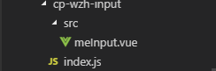

# 行内添加数据
## 在components目录下新创建一个文件夹cp-wzh-input,在此文件夹内在创建一个src文件夹用来存储我们新的组件，同样在此文件夹下创建一个index.js文件用来暴露我们的组件。

## 在index.js中将组件暴露出来
```javascript
import MeInput from './src/meInput.vue'
export default MeInput
```
## 在meTable.vue中注册这个组件,并将我们所需要的值传入子组件中
```html
<Meinput :table-data="tableData"" />
```
```javascript
import Meinput from "@/components/cp-wzh-input/index.js"
export default {
  components: {
    Meinput
  }
}
```
## 接下来在子组件中将我们需要的组件写入，我们需要用到button框与Form表单，所以我们将其写入
```html
 <div>
    <ElButton
      v-if="show"
      icon="el-icon-plus"
      type="info"
      plain
      style="width:90%;float:left"
      @click="showup"
    />
    <ElForm v-if="!show">
      <ElInput v-model="formInline.user" placeholder="姓名" style="width:170px; float:left" />

      <ElInput v-model="formInline.region" placeholder="数量" style="width:170px; float:left" />

      <ElButton type="primary" style="float:left" @click="onSubmit">
        确认
      </ElButton>
      <ElButton type="primary" style="float:left" @click="onnum">
        取消
      </ElButton>
    </ElForm>
  </div>
```
## 我们为Button和ElForm绑定一个v-if用操纵他和表单的隐藏显示，因为我们要获取到input框中的值，所以我们给input框一个双向绑定，在javascript中接收数据并在data中写入我们需要的数据。
```javascript
export default {
  props: {
    tableData: {
      type: Array,
      default() {
        return []
      }
    }
  },
  data() {
    return {
      show: true,
      formInline: {
        user: '',
        region: ''
      }
    }
  }
}
```
## 在表单中有确认和取消两个按钮，分别为其绑定一个事件并监听，监听它的点击事件，在上面的添加按钮也有一个监听，监听它的点击事件，当我们点击添加的时候，让添加按钮消失并让表单显示，当我们按下确认按钮的时候将我们的数据提交到父组件并push到tableData中，这也就添加了数据，如果点击取消按钮，输入框内就会变成空的并让表单隐藏，添加按钮显示。
```javascript
export default {
  props: {
    tableData: {
      type: Array,
      default() {
        return []
      }
    }
  },
  data() {
    return {
      show: true,
      formInline: {
        user: '',
        region: ''
      }
    }
  },
  methods: {
    showup() {
      this.show = false
    },
    onSubmit() {
      var name = this.formInline.user
      var value = this.formInline.region
      this.$emit("out", name, value)
      this.formInline.user = ""
      this.formInline.region = ""
    },
    onnum() {
      this.show = true
      this.formInline.user = ""
      this.formInline.region = ""
    }
  }
}
```
```html
<!-- meTable.vue -->
    <Meinput :table-data="tableData" @out="out" />
```
```javascript
out(na, val) {
      this.tableData.push({
        name: na,
        value: val
      })
    }
```